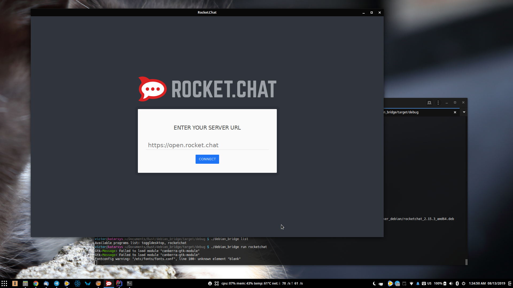

# debian_bridge
[](https://travis-ci.com/22116/debian_bridge)

### Caution!

> Author is not using non-debian distro and will not support this project in near future. Be free to create a PRs or Fork the roject at all.


CLI tool to automatize creation and running an applications with debian using docker.

```
debian_bridge 1.0.0
victor <fedorenko22116@gmail.com>

USAGE:
    debian_bridge [FLAGS] [OPTIONS] <SUBCOMMAND>

FLAGS:
    -h, --help       Prints help information
    -V, --version    Prints version information
    -v               Set the level of verbosity

OPTIONS:
    -c, --config <FILE>    Set a custom config file

SUBCOMMANDS:
    create    Create new docker build for existed package
    help      Prints this message or the help of the given subcommand(s)
    list      Show installed programs
    remove    Remove program
    run       Run installed program
    test      Test compatibility and feature access

```

## Installation

* Install Cargo with 
```shell script
curl https://sh.rustup.rs -sSf | sh
echo 'export PATH=$PATH:~/.cargo/bin' >> ~/.bashrc
source ~/.bashrc
```
* Install `debian_bridge` with `cargo install --git https://github.com/22116/debian_bridge`
(You might need gcc compiler to be installed. On solus you can get it by `sudo eopkg it -c system.devel` command)
* Run `debian_bridge`

## Responsibilities

* Building a docker image based on input .deb files
* Creation a .desktop entries
* Automate running of created containers

## Prerequirements

* Docker ^1.11 with no `sudo` access

## Example

Tested on Solus 3 OS (Budgie with X11 WM) with rocketchat_2.15.3.deb

### Check if your system has a support of features

```
$ debian_bridge test
System settings: 

	Docker version  ===> 1.40
	Window manager  ===> X11
	Sound driver    ===> PulseAudio

Available features: 

	Notification    ===> available
	Home persistent ===> available
	Timezone        ===> available
	Display         ===> available
	Devices         ===> available
	Sound           ===> available
```

### Creating an application

```
$ debian_bridge create -dshnti --dependencies 'libasound2' --command 'rocketchat-desktop' ~/Downloads/rocketchat_2.15.3_amd64.deb
```

Fine, `rocketchat` application created with a shared `display`, `sound`, `notifications`, `timezone`, `devices` and `home` directory. All required dependencies for `rocketchat` were automatically installed. 
Additional libs like `libasound2` which are not specified in .deb package can be added with `dependencies` argument. \
By default package name will be used as a command, but it's not a case with a `rocketchat`, so command name (`rocketchat-desktop`) was additionaly passed.\
To automatically create a .desktop entry in `$HOME/Desktop` add `icon-desktop default` or `icon-desktop <path>` to the command

### Listing

```
$ debian_bridge list
Available programs list: rocketchat
```

As you can see, created program has a default package name by default.

### Running

```
$ debian_bridge run rocketchat
```



### Removing

```
$ debian_bridge remove rocketchat
```
